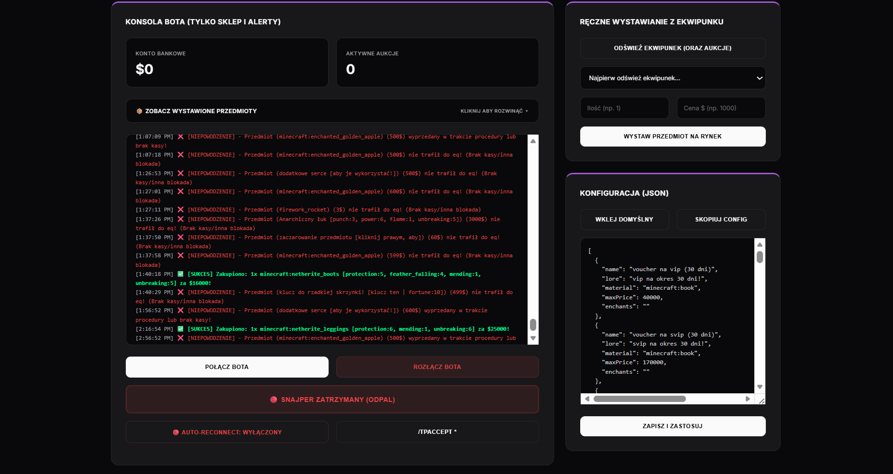

# Automated Market Arbitrage & Data Analysis System
*Proof of Concept / Technical Showcase*

An event-driven automation framework built in Node.js, designed to perform high-frequency data analysis and execution within a virtual market environment. Features include real-time price parsing via Regex, network latency optimization, and a secure command-and-control (C2) web dashboard.

*(Note: Due to the competitive nature of automated market execution and the specific platform implementations involved, the core source code is kept private. This repository serves as a showcase of the system's architecture and capabilities.)*

---

## 📸 Showcase / Screenshots

### Central Control Dashboard

*Fig 1. The main web interface for monitoring and managing multiple arbitrage agents, displaying real-time instance statuses and owner assignments.*

### Arbitrage Configuration & Log Terminal

*Fig 2. Advanced configuration panel demonstrating live telemetry, a real-time event execution terminal (tracking transaction successes and failures), and the JSON-based arbitrage logic editor.*

---

#### Key Technical Features

**1. High-Frequency Market Scanning & Event Parsing**
* Built an event-driven loop that rapidly scans and parses complex, unformatted text data (market items and lore) using advanced Regular Expressions (`Regex`).
* Dynamically extracts pricing, names, and custom variables to instantly compare against predefined "buy" thresholds.
* Automatically processes "purchase" events within milliseconds of detection.

**2. Network Latency Optimization (Low-Ping Routing)**
* Conducted advanced network analysis (`traceroute`, ping optimization) to host the bot on servers physically closest to the target market server.
* This ensures the lowest possible network latency, outperforming human interaction and other automated systems in execution speed.

**3. Robust Error Handling & "Watchdog" System**
* Engineered a custom Watchdog mechanism that monitors the "heartbeat" of the main execution loop.
* If the system detects a freeze or network timeout lasting longer than 90 seconds, the Watchdog performs a hard reset on the instance states, ensuring 24/7 autonomous reliability (Fault Tolerance).

**4. Secure Web Panel & Audit Logging**
* Developed an Express/Socket.IO web dashboard protected by a custom authentication gateway with session persistence (HTTP Cookies).
* Implemented strict Audit Logging: Every access attempt (successful or failed) logs the incoming IP address and the attempted password, mimicking basic SIEM alert functionalities.

**5. Real-Time Alerting (Discord Integration)**
* Integrated with the Discord API to send push notifications for critical events, such as successful market executions, inventory capacity warnings, and severe network disconnects.

#### Tech Stack
* **Core:** Node.js, Express
* **Networking:** Socket.IO (WebSockets), DNS / Network Path Optimization
* **Data Parsing:** Regex, JSON Configurations
* **Alerting:** Discord.js API

#### Educational Value
*This project highlights advanced skills in building fault-tolerant automation, parsing unstructured data in real-time, optimizing network latency, and implementing secure access controls with audit trails.*
